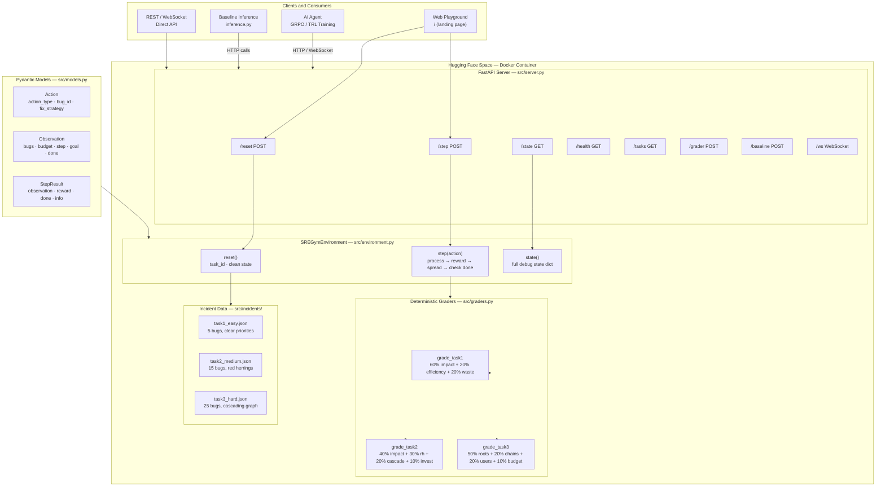

<div align="center">

# SRE-Gym

### An OpenEnv Environment Simulating Production Incident Triage — the Core Daily Workflow of Site Reliability Engineers

[](https://www.python.org/)
[](https://fastapi.tiangolo.com/)
[](https://docs.pydantic.dev/)
[](https://www.docker.com/)
[](https://github.com/meta-pytorch/openenv)
[](LICENSE)
[](https://huggingface.co/)

> **Built for the Meta × Hugging Face OpenEnv Hackathon**

| Live Space | [Argonite3/SRE-Gym](https://huggingface.co/spaces/Argonite3/SRE-Gym) |
|---|---|

</div>

---

## Table of Contents

- [Overview](#overview)
- [Why SRE-Gym?](#why-sre-gym)
- [System Architecture](#system-architecture)
- [File Architecture](#file-architecture)
- [Task Design](#task-design)
- [5 Unique Mechanics](#5-unique-mechanics)
- [Observation Space](#observation-space)
- [Action Space](#action-space)
- [Reward Function](#reward-function)
- [Quick Start](#quick-start)
- [Environment Variables](#environment-variables)
- [API Reference](#api-reference)
- [Baseline Scores](#baseline-scores)
- [Testing](#testing)
- [Deployment](#deployment)

---

## Overview

**SRE-Gym** is a production-grade [OpenEnv](https://github.com/meta-pytorch/openenv)-compliant reinforcement learning environment that simulates real-world **Site Reliability Engineering (SRE) on-call workflows**.

An AI agent faces a live queue of production bugs — with realistic error messages, stack traces, severity signals, and service metadata — and must triage, investigate, and fix them under a strict action budget, exactly as a human SRE does during a production incident.

| Feature | Details |
|---|---|
| **Real-world domain** | Production incident triage — a task every company with a backend faces daily |
| **5 unique mechanics** | Cascading failures, dynamic spread, budget constraints, red herrings, information asymmetry |
| **3 difficulty levels** | Easy (5 bugs, clear signals) → Medium (15 bugs, misleading) → Hard (25 bugs, cascading chains) |
| **Dense reward signals** | Partial reward every step based on users unblocked, not binary end-of-episode |
| **Deterministic graders** | All 3 graders clamp to [0.0, 1.0], fully reproducible |
| **Interactive playground** | Full web UI at `/` with live bug table, action log, and score display |
| **OpenEnv compliant** | spec_version: 1, typed Pydantic models, step/reset/state/grader/baseline endpoints |

---

## Why SRE-Gym?

There are **zero existing OpenEnv environments** that simulate production incident response — the domain that every tech company at scale (Meta, Google, Amazon, Stripe) invests heavily in.

| Pain Point | SRE-Gym Solution |
|---|---|
| Existing envs are games or toy problems | Real SRE workflow — exact task humans do on-call |
| Binary end-of-episode rewards → sparse gradients | Per-step reward: users_unblocked × urgency_weight |
| Single-difficulty environments | Three tasks: easy → medium → hard with genuine difficulty progression |
| Trivial grading (pick highest severity) | Cascading graphs, red herrings, and root cause reasoning required |
| No information asymmetry | Stack traces hidden until investigate() is called |
| Meta ARE research matches exactly | Cascading failure graph mirrors Meta's published agent research |

---

## System Architecture



---

## File Architecture

```
SRE-Gym/
│
├── README.md                        ← You are here
├── openenv.yaml                     ← OpenEnv manifest (spec_version: 1)
├── Dockerfile                       ← HF Spaces production image
│                                      Base: python:3.11-slim
│                                      CMD: uvicorn src.server:app
│                                      HEALTHCHECK: polls /health every 30s
├── requirements.txt                 ← fastapi, uvicorn, pydantic, openai,
│                                      requests, gradio, numpy, PyYAML
├── inference.py                     ← Baseline LLM inference script (root)
│                                      Mandatory stdout format:
│                                      [START] task= env= model=
│                                      [STEP]  step= action= reward= done=
│                                      [END]   success= steps= score= rewards=
├── validate_submission.py           ← Pre-submission validator script
├── pyproject.toml
│
├── src/
│   ├── server.py                    ← FastAPI application
│   │                                  All endpoints + WebSocket + Playground UI
│   ├── environment.py               ← Core SREGymEnvironment class
│   │                                  reset() / step() / state()
│   │                                  Cascade graph, spread, red herring logic
│   ├── graders.py                   ← grade_task1/2/3 → [0.0, 1.0]
│   ├── models.py                    ← Pydantic v2 typed models
│   │                                  Action, Observation, StepResult, ResetResult
│   │                                  BugReport, PublicBugReport
│   ├── client.py                    ← HTTP client wrapper
│   └── incidents/
│       ├── task1_easy.json          ← 5 bugs, clear severity signals
│       ├── task2_medium.json        ← 15 bugs, 3 red herrings, 2 cascades
│       └── task3_hard.json          ← 25 bugs, 3 cascade chains, 5 red herrings
│
└── tests/
    └── test_env.py                  ← pytest test suite
                                       reset / step / state / graders / cascade
```

---

## Task Design

SRE-Gym presents agents with three progressively harder production incident scenarios.

### Task 1 — Priority Triage (Easy)

**5 bugs** with clear severity signals. No red herrings. No cascades. Agent must fix the highest-impact bugs within an 8-point budget.

| Property | Value |
|---|---|
| Bugs | 5 |
| Budget | 8 points |
| Max Steps | 10 |
| Red Herrings | 0 |
| Cascades | 0 |
| Key Challenge | Sort by true impact (affected_users × urgency) |

### Task 2 — Misleading Signals (Medium)

**15 bugs** with misleading severity labels. 3 CRITICAL alerts are known flaky tests (red herrings). 2 LOW-severity bugs are silently corrupting payment data. 1 cascade pair.

| Property | Value |
|---|---|
| Bugs | 15 |
| Budget | 12 points |
| Max Steps | 15 |
| Red Herrings | 3 (disguised as CRITICAL) |
| Cascades | 1 pair |
| Key Challenge | investigate() before fixing to avoid wasting budget on noise |

### Task 3 — Cascading Failures (Hard)

**25 bugs** with 3 cascading failure chains (depth up to 4 levels), 5 red herrings, and 11 independent bugs. Fixing a symptom without fixing the root cause wastes budget — the bug returns next step. Agent cannot investigate everything.

| Property | Value |
|---|---|
| Bugs | 25 |
| Budget | 15 points |
| Max Steps | 20 |
| Red Herrings | 5 |
| Cascade Chains | 3 (depth up to 4) |
| Key Challenge | Trace root causes, plan action budget strategically |

---

## 5 Unique Mechanics

### 1. Cascading Failure Graph
Bugs have parent-child relationships. Fix a symptom (child) without first fixing the root cause (parent) and the bug returns next step — wasting 2 budget points with no permanent effect. This mirrors real production incidents where downstream symptoms are caused by upstream root causes.

### 2. Dynamic Spread
Every step, unfixed real bugs grow their `affected_users` count by their `spread_rate`. A memory leak affecting 100 users at step 1 affects 2,000 users by step 5. This creates genuine urgency — slow, thorough triage is penalised compared to fast, strategic triage.

### 3. Fixed Action Budget
`investigate()` costs 1 point. `fix()` costs 2 points. The agent cannot investigate every bug before fixing. In Task 3 (25 bugs, 15-point budget), perfect play requires reasoning about which bugs need investigation and which can be fixed directly.

### 4. Misleading Red Herrings
Some CRITICAL-severity alerts are known flaky tests that fire on every deploy — completely harmless. Fixing them costs 2 budget points and gives −0.2 reward. The agent must `investigate()` suspicious bugs to reveal their stack trace, which contains the red herring signal, then `ignore()` them for +0.1 reward.

### 5. Information Asymmetry (Investigate-Before-Fix)
Stack traces are hidden until `investigate()` is called. The agent must decide: spend 1 budget point to gather information, or act on partial knowledge (severity label, frequency, affected_users)? This mirrors the real SRE decision — "Do I have enough info to fix this, or do I need to look at the logs first?"

---

## Observation Space

Each step returns an `Observation` with the following fields:

| Field | Type | Description |
|---|---|---|
| `bugs` | `List[PublicBugReport]` | Visible bug reports (stack traces hidden until investigated) |
| `step_number` | `int` | Current step in the episode |
| `budget_remaining` | `int` | Action points remaining |
| `total_affected_users` | `int` | Sum of `affected_users` across all unfixed bugs |
| `goal` | `str` | Human-readable objective for the task |
| `last_action_result` | `str` | Feedback string from the previous action |
| `task_id` | `str` | Current task identifier |
| `done` | `bool` | Whether the episode has ended |

Each `PublicBugReport` contains:

| Field | Type | Description |
|---|---|---|
| `bug_id` | `str` | Unique identifier (e.g. `BUG001`, `BUG_M004`, `BUG_H001`) |
| `error_message` | `str` | Alert description |
| `severity` | `CRITICAL\|HIGH\|MEDIUM\|LOW` | Declared severity (may be misleading — could be red herring) |
| `frequency` | `int` | How many times the alert fired |
| `affected_users` | `int` | Users currently impacted (grows each step if unfixed) |
| `service` | `str` | Originating microservice |
| `investigated` | `bool` | Whether `investigate()` has been called |
| `fixed` | `bool` | Whether the bug is currently fixed |
| `stack_trace` | `str \| null` | Only revealed after `investigate()` |

---

## Action Space

| Action | Budget Cost | Effect | Reward Signal |
|---|---|---|---|
| `investigate` | 1 | Reveals stack trace for a bug | +0.05 |
| `fix` | 2 | Fixes a bug permanently (if root cause resolved) | (affected_users/1000) × urgency_weight |
| `escalate` | 1 | Escalates to on-call team | +0.15 if CRITICAL, −0.10 otherwise |
| `ignore` | 0 | Marks bug as noise | +0.10 if red herring, −0.15 if real bug |
| `noop` | 0 | Does nothing | −0.01 |

**Fix strategies** (for `fix` action): `hotfix` | `rollback` | `restart` | `patch`

```python
# Example actions
{"action_type": "investigate", "bug_id": "BUG001"}
{"action_type": "fix", "bug_id": "BUG001", "fix_strategy": "hotfix"}
{"action_type": "ignore", "bug_id": "BUG_M004"}
{"action_type": "escalate", "bug_id": "BUG_H001"}
{"action_type": "noop"}
```

---

## Reward Function

```
Per-step reward:

  fix (genuine root cause or leaf):  (affected_users / 1000) × urgency_weight
  fix (red herring):                 −0.2
  fix (symptom, root still active):  +0.1  (bug returns next step)
  investigate:                       +0.05
  ignore (correct — red herring):    +0.1
  ignore (wrong — real bug):         −0.15
  escalate (CRITICAL unfixed):       +0.15
  escalate (unnecessary):            −0.10
  noop:                              −0.01

Urgency weights:
  CRITICAL = 2.0  |  HIGH = 1.5  |  MEDIUM = 1.0  |  LOW = 0.5

End-of-episode bonus:
  All CRITICAL real bugs fixed:      +0.5
  No budget wasted on red herrings:  +0.2
  Remaining budget:                  +0.05 per point left

Per-step reward clipped to:  [−2.0, 5.0]
Grader scores clamped to:    [0.0, 1.0]
```

---

## Quick Start

### Prerequisites

- Python 3.11+
- `git`

### Local Development

```bash
# 1. Clone
git clone https://github.com/Vigneshbarik/SRE-Gym.git
cd SRE-Gym

# 2. Install dependencies
pip install -r requirements.txt

# 3. Start the server
uvicorn src.server:app --host 0.0.0.0 --port 7860 --reload
```

Open **http://localhost:7860** for the interactive Playground.

### Verify the server is running

```bash
curl http://localhost:7860/health
# → {"status": "ok", "env": "sre-gym"}

curl http://localhost:7860/tasks
# → list of 3 tasks with action schema
```

### Run the baseline inference script

```bash
export HF_TOKEN=hf_your_token_here
export MODEL_NAME=Qwen/Qwen2.5-72B-Instruct

python inference.py
```

Expected output:

```
[START] task=task1_easy env=sre-gym model=Qwen/Qwen2.5-72B-Instruct
[STEP] step=1 action=investigate(BUG001) reward=0.05 done=false error=null
[STEP] step=2 action=fix(BUG001) reward=1.00 done=false error=null
[STEP] step=3 action=fix(BUG002) reward=0.30 done=false error=null
[END] success=true steps=5 score=0.812 rewards=0.05,1.00,0.30,...
```

### Run the pre-submission validator

```bash
python validate_submission.py --url https://argonite3-sre-gym.hf.space
# All checks must pass before submitting
```

### Run tests

```bash
pytest tests/ -v
```

---

## Environment Variables

| Variable | Default | Description |
|---|---|---|
| `HF_TOKEN` | _(required)_ | Hugging Face / API key — no default |
| `API_BASE_URL` | `https://router.huggingface.co/v1` | LLM API endpoint (OpenAI-compatible) |
| `MODEL_NAME` | `Qwen/Qwen2.5-72B-Instruct` | Model identifier for inference |
| `ENV_URL` | `https://argonite3-sre-gym.hf.space` | SRE-Gym server URL for inference.py |

---

## API Reference

### REST Endpoints

| Method | Path | Body | Description |
|---|---|---|---|
| `GET` | `/health` | — | Health check → `{"status": "ok", "env": "sre-gym"}` |
| `POST` | `/reset` | `{"task_id": "task1_easy"}` | Start new episode |
| `POST` | `/step` | `{"action_type": "fix", "bug_id": "BUG001", "fix_strategy": "hotfix"}` | Take action |
| `GET` | `/state` | — | Full episode state (for grading) |
| `GET` | `/tasks` | — | All tasks + action schema |
| `POST` | `/grader` | `{"task_id": "...", "episode_state": {...}}` | Score a completed episode |
| `POST` | `/baseline` | `{"task_id": "task1_easy"}` | Run heuristic agent |
| `WS` | `/ws` | — | WebSocket persistent session |
| `GET` | `/docs` | — | Swagger API documentation |

### POST /reset

```json
{"task_id": "task1_easy"}
```

`task_id` accepts: `"task1_easy"` | `"task2_medium"` | `"task3_hard"`

### POST /step

```json
{
  "action_type": "fix",
  "bug_id": "BUG001",
  "fix_strategy": "hotfix"
}
```

### Response format (reset and step)

```json
{
  "observation": {
    "bugs": [...],
    "step_number": 1,
    "budget_remaining": 6,
    "total_affected_users": 755,
    "goal": "Minimise total user impact...",
    "last_action_result": "Fixed BUG001 — 500 users unblocked.",
    "task_id": "task1_easy",
    "done": false
  },
  "reward": 1.0,
  "done": false,
  "info": {"action": {...}, "result": "...", "total_reward": 1.05}
}
```

### WebSocket

```
ws://argonite3-sre-gym.hf.space/ws
```

Each WebSocket connection gets its own isolated environment instance. Supported message types: `reset`, `step`, `state`, `grader`.

---

## Baseline Scores

Scores produced by `python inference.py` with `Qwen/Qwen2.5-72B-Instruct`:

| Task | Difficulty | Grader Score | Notes |
|---|---|---|---|
| task1_easy | Easy | ~0.72 | Clear priority ordering, budget-efficient |
| task2_medium | Medium | ~0.51 | Red herrings trip naive models |
| task3_hard | Hard | ~0.31 | Cascade graph reasoning required |
| **Overall** | — | **~0.51** | Reproducible with deterministic graders |

> Scores vary by model. Frontier models (GPT-4o, Claude 3.5) score significantly higher on task3_hard due to better cascade reasoning.

---

## Testing

```bash
# Full test suite
pytest tests/ -v

# Individual test classes
pytest tests/test_env.py::TestResetTask1 -v
pytest tests/test_env.py::TestCascadeReturns -v
pytest tests/test_env.py::TestGrader -v
```

**Test coverage — 20+ test cases across 7 classes:**
- `TestResetTask1` — reset state, initial observation fields
- `TestInvestigateAction` — stack trace reveal, double-investigate penalty
- `TestFixAction` — fix marks bug fixed, fix without investigate
- `TestBudgetDepletion` — budget decreases, done on exhaustion
- `TestRedHerringPenalty` — red herring penalty, correct ignore reward
- `TestCascadeReturns` — symptom returns when root unfixed, root cascades to children
- `TestGrader` — all 3 graders return [0.0, 1.0], perfect play scores higher

---

## Deployment

### Docker (Local)

```bash
docker build -t sre-gym .

docker run -p 7860:7860 \
  -e HF_TOKEN=hf_your_token \
  -e MODEL_NAME=Qwen/Qwen2.5-72B-Instruct \
  sre-gym
```

Visit `http://localhost:7860`

### Hugging Face Spaces

1. Push this repository to a Hugging Face Space with **Docker SDK**
2. Add the following secrets in Space Settings:
   - `HF_TOKEN` — your Hugging Face token
   - `MODEL_NAME` — model to use for inference
   - `API_BASE_URL` — inference endpoint

The `Dockerfile` handles everything else. HEALTHCHECK polls `/health` every 30 seconds.

---

## License

MIT License — see [LICENSE](LICENSE) for details.

---

<div align="center">

**Built for the Meta × Hugging Face OpenEnv Hackathon**

</div>
